# HW3

РАБОТА НА СЕМИНАРАХ

№2. и
в
он
на
не
с
царь
как
ты
быть
№3. царь
сей
град
казань
стена
меч
глава
кровь
слава
сердце

№4

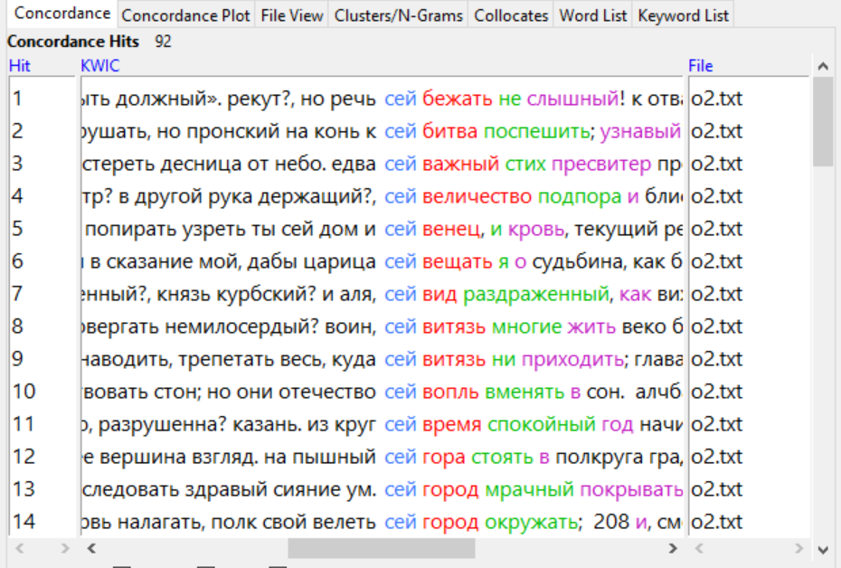

№5

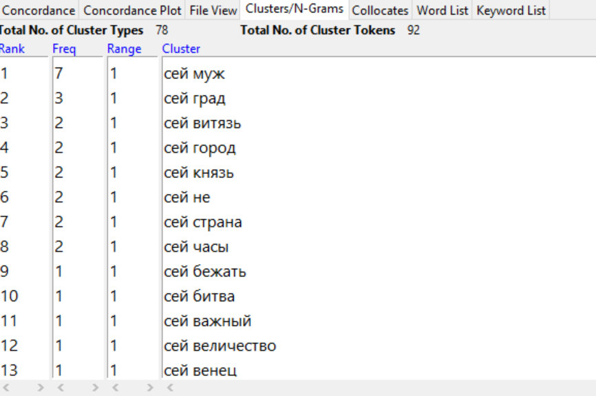

№6

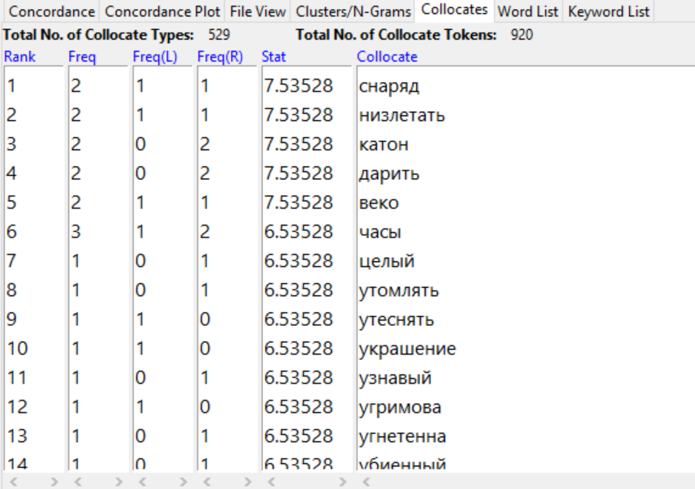

график с семинара
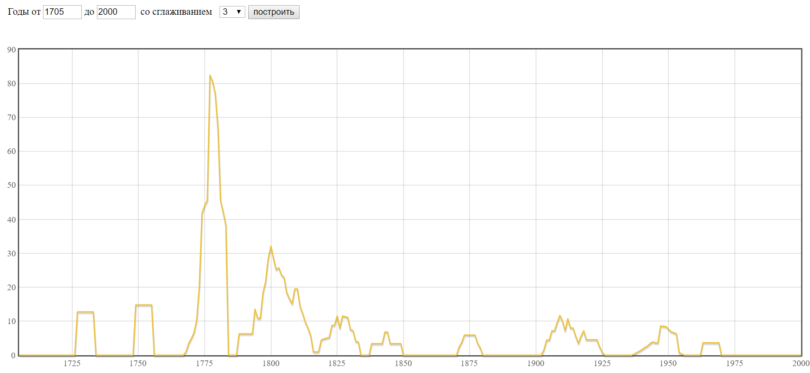

ДОМАШНЯЯ РАБОТА

1)

№4

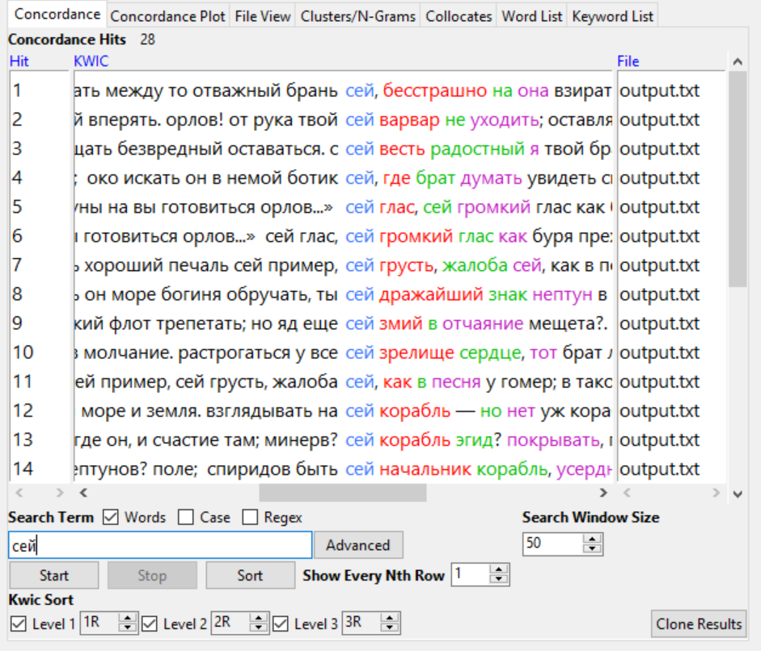

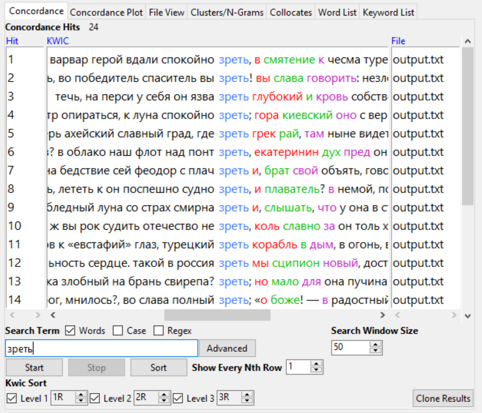

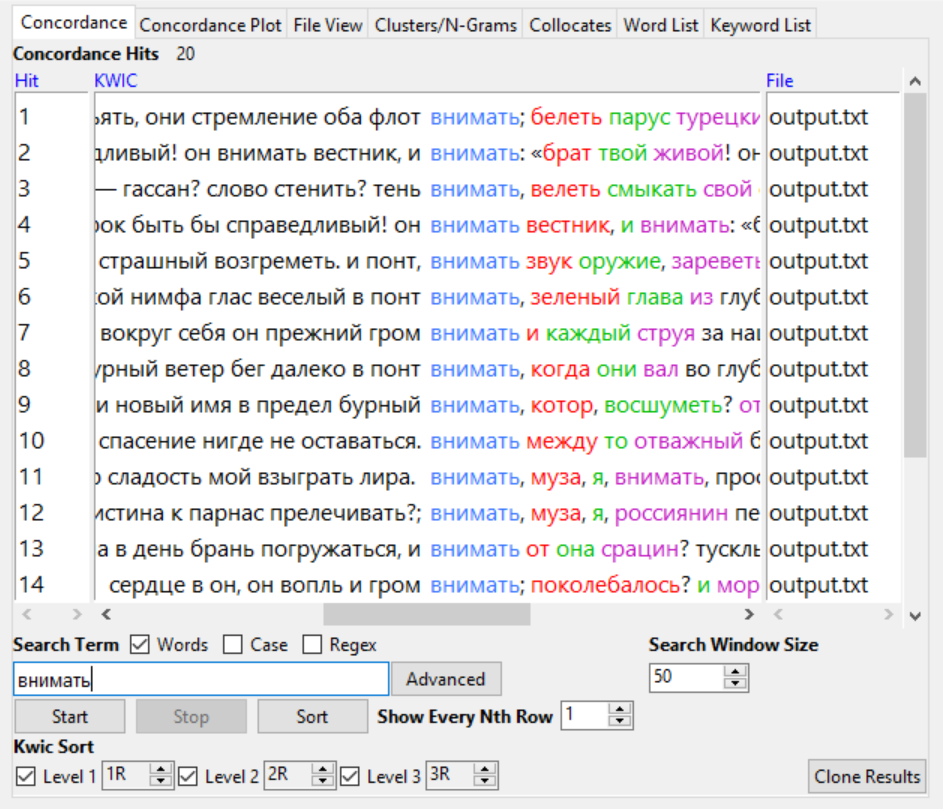

№5

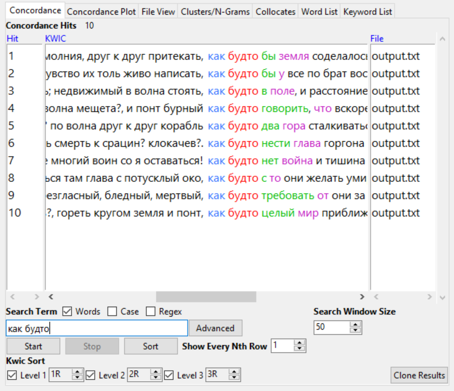

№6

2)

№2

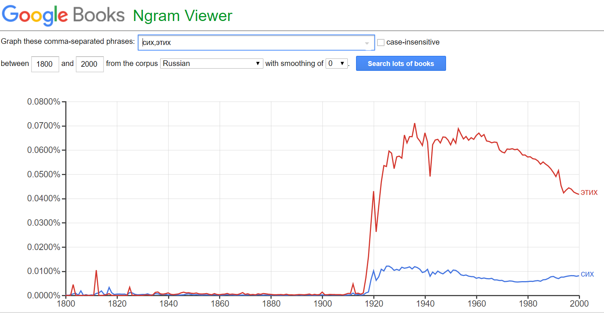

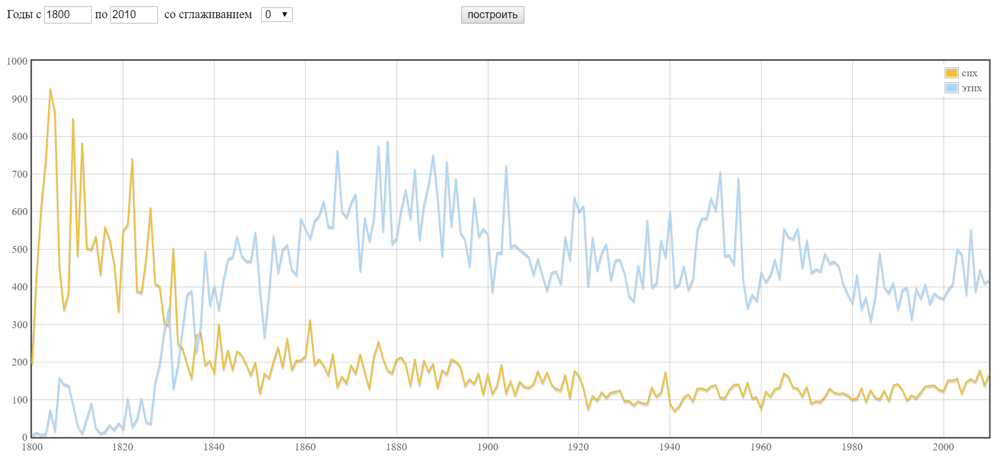

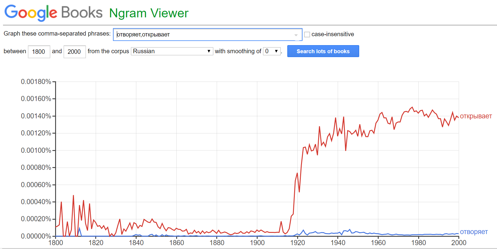

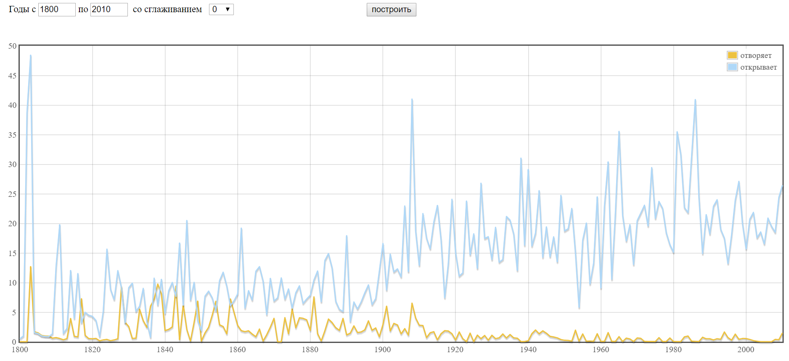

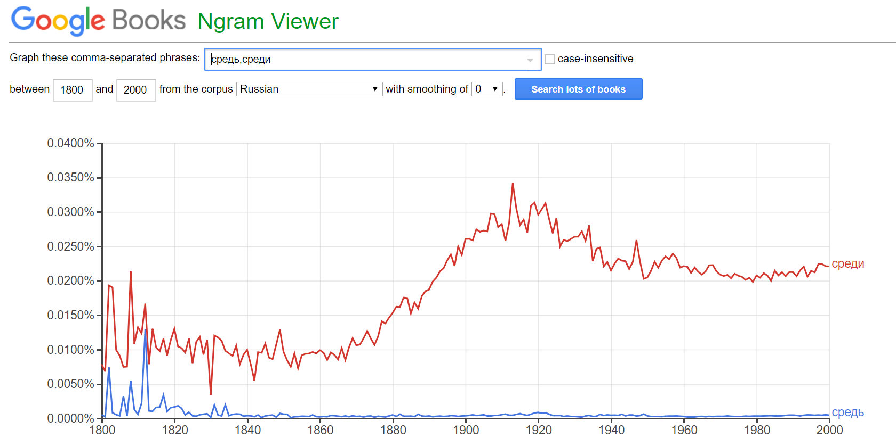

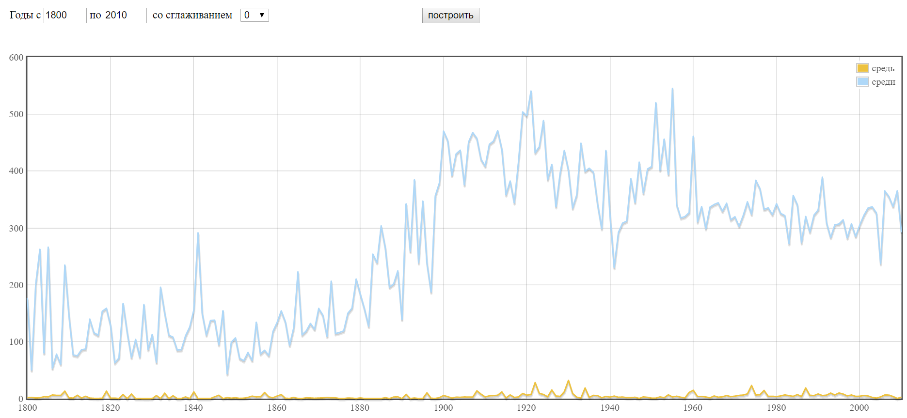

